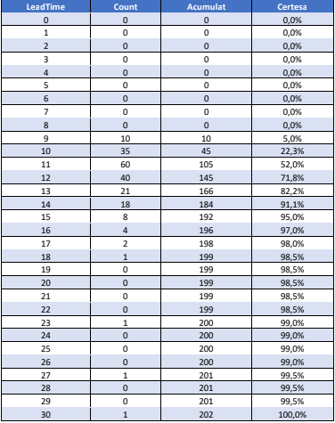
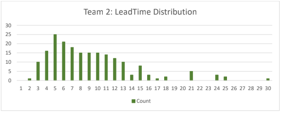
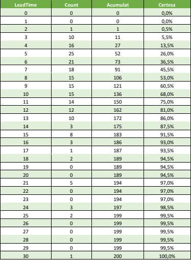

# Forecasting
## 1.Forecast development team
Un equip de desenvolupament té el següent comportament
    

### 1.1.Quina certesa tenim d’acabar la tasca en 5 dies?

    En 5 días hay un 0,0% que el equipo 1 complete la tarea

### 1.2.i en 9 dies?

    En 9 días hay un 5,0% que el equipo 1 complete la tarea

### 1.3.El client vol una data d’entrega fiable, què li diries?

    En 13 dias había un 82%  de posibilidades de acierto

### 1.4.En quines condicions es pot aplicar correctament el forecasting?

    Es cuando la empresa tiene suficientes datos para estimar lo que tarda cada equipo en trabajar y en realizar una tarea

## 2: LeadTime Distribution
 tenim un seguent equip con altre comportament

### 2.1.Quin equip té més possibilitats d’entregar una tasca abans? 

    el equipo 2 es más probable que acabe antes una tarea ya tienen un historial de acabar las tareas en menos tiempo

### 2.2.Quin dels dos equips (Team 1 o Team 2) diries que és més ràpid? Raona la teva resposta. 
    
    El 2 ya que como he explicado el parte anterior el 2 es más rápido al completar tareas ya que históricamente acaban antes que el 1

### 2.3.Amb quina certesa entregarà cada equip una tasca en 10 dies? 
    
    El equipo 1 tiene un 22,3% en acabar una tarea en 10 días y el equipo 2 tiene un 68%
    
### 2.4.Quant trigarà cada equip en entregar una tasca amb una certesa del 60%? 
    
    El equipo 1 tardara 11’5 días en alcanzar el 60% aproximadamente y el equipo 2 tardara 9 dias en alcanzar el 60%

### 2.5.Quin dels dos equips té un millor forecasting?

    El 2 ya que tiene un historial de acabar tareas más rápidamente.
