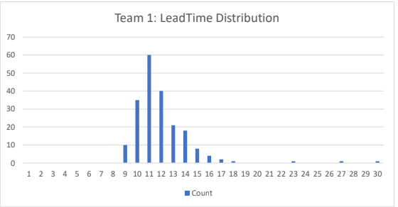

# Forecasting
## 1.Forecast development team
Un equip de desenvolupament té el següent comportament
    
    
###1.1.Quina certesa tenim d’acabar la tasca en 5 dies?

    En 5 días hay un 0,0% que el equipo 1 complete la tarea

###1.2.i en 9 dies?

    En 9 días hay un 5,0% que el equipo 1 complete la tarea

###1.3.El client vol una data d’entrega fiable, què li diries?

    En 13 dias había un 82%  de posibilidades de acierto

###1.4.En quines condicions es pot aplicar correctament el forecasting?

    Es cuando la empresa tiene suficientes datos para estimar lo que tarda cada equipo en trabajar y en realizar una tarea
